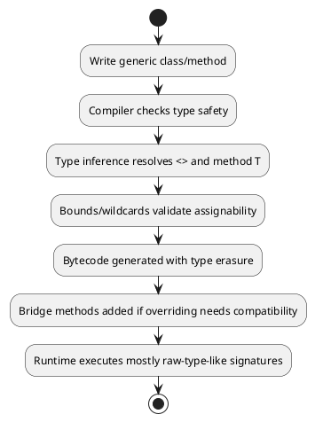
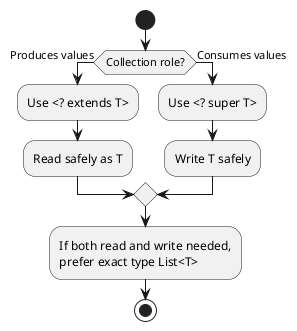

# Core Java Package 11 Notes

- Goal: understand Java Generics end-to-end including type safety, bounds, wildcards, PECS, type erasure, bridge methods, variance, restrictions, and interview-focused practical usage.

## Why Generics In Java

- Generics allow writing reusable classes and methods while preserving compile-time type safety.
- Without generics (raw types), wrong data can be inserted and failures appear later at runtime.
- With generics, compiler validates type compatibility early and reduces explicit casts.
- Generics primarily work at compile time; at runtime Java uses type erasure.

## Raw Type Vs Generic Type

- Raw type example:

```java
List raw = new ArrayList();
raw.add("java");
raw.add(10);
String value = (String) raw.get(1); // ClassCastException at runtime
```

- Generic example:

```java
List<String> topics = new ArrayList<>();
topics.add("java");
// topics.add(10); // compile-time error
```

- Key point: raw type skips generic checks and should be avoided in new code.

## Generic Class Basics

- Generic class uses type parameter placeholders (usually `T`, `E`, `K`, `V`).
- Example:

```java
class Box<T> {
    private final T value;
    Box(T value) {
        this.value = value;
    }
    T getValue() {
        return value;
    }
}
```

- Usage:

```java
Box<String> textBox = new Box<>("Core Java");
Box<Integer> marksBox = new Box<>(95);
```

- Multi-parameter generic class:

```java
class Pair<K, V> {
    K key;
    V value;
}
```

## Generic Constructors

- A constructor can declare its own type parameter independent of class type parameters.
- Example from this package (`src/core_java_11/Main.java`):

```java
static final class Box<T> {
    private final T value;
    private final String source;

    <U> Box(T value, U sourceMeta) {
        this.value = value;
        this.source = String.valueOf(sourceMeta);
    }
}
```

- Here `T` belongs to class, and `U` belongs only to constructor.

## Generic Methods

- Method declares type parameter before return type.
- Can be static or instance methods.
- Independent from whether class itself is generic.

```java
public static <T> T pickFirst(T first, T second) {
    return first != null ? first : second;
}
```

## Bounded Type Parameters

- Upper bound restricts accepted types:

```java
private static <T extends Number> double average(List<T> values) {
    double sum = 0;
    for (Number value : values) {
        sum += value.doubleValue();
    }
    return sum / values.size();
}
```

- Recursive bound (type-safe comparison):

```java
private static <T extends Comparable<T>> T maxOf(T a, T b) {
    return a.compareTo(b) >= 0 ? a : b;
}
```

- Multiple bounds: class first, then interfaces.

```java
<T extends Assessable & Reportable & Comparable<T>>
```

## Wildcards

- Unbounded wildcard `List<?>`
  - unknown element type
  - safe for reading as `Object`
  - cannot add concrete values (except `null`)
- Upper bounded wildcard `<? extends T>`
  - producer of `T`
  - good for reading
  - not safe for adding values
- Lower bounded wildcard `<? super T>`
  - consumer of `T`
  - safe for adding `T`
  - read type is `Object`

## PECS Rule

- PECS = Producer Extends, Consumer Super.
- If source only provides values of type `T`, use `<? extends T>`.
- If destination only consumes values of type `T`, use `<? super T>`.
- Example from this package:

```java
private static void fillWithIntegers(List<? super Integer> list) {
    list.add(10);
    list.add(20);
}
```

## Generics Invariance Vs Array Covariance

- Arrays are covariant:

```java
Object[] values = new String[2];
values[1] = 10; // ArrayStoreException at runtime
```

- Generics are invariant:
  - `List<Integer>` is not a subtype of `List<Number>`.
  - need wildcards for flexibility (`List<? extends Number>` or `List<? super Integer>`).

## Heap Pollution

- Heap pollution means a variable of parameterized type references value not of that type.
- Common with raw types, unchecked casts, varargs + generics, and generic arrays workarounds.
- In this package, array + generic cast example demonstrates runtime `ClassCastException` risk.

## Type Erasure

- During compilation, generic type info is erased.
- `List<String>` and `List<Integer>` become raw-like `List` at runtime.
- Why Java does this:
  - backward compatibility with pre-generics bytecode and JVM behavior.

### Type Erasure Effects

- Cannot instantiate type parameter directly (`new T()` not allowed).
- Cannot use parameterized type directly with `instanceof` (`obj instanceof List<String>` invalid).
- Cannot create generic arrays directly (`new T[10]` invalid).
- Cannot declare generic exception class and cannot catch type parameter.

## Bridge Methods

- Bridge methods are compiler-generated synthetic methods.
- They preserve polymorphism after type erasure in overriding scenarios.
- This package includes runtime reflection in `demonstrateTypeErasureAndBridgeMethods()` to detect bridge methods.

## Generic Interfaces

- Generic interface defines contract with a type parameter.

```java
interface Repository<T> {
    void save(T value);
    T findLatest();
}
```

- Implementation options:
  - fixed type implementation (`StringRepository implements Repository<String>` through inheritance chain)
  - generic implementation (`MemoryRepository<T> implements Repository<T>`)

## Type Inference And Diamond Operator

- Diamond operator `<>` reduces duplication at creation:

```java
List<String> list = new ArrayList<>();
```

- Compiler infers method type arguments in many cases.
- Java 8 significantly improved inference (especially with lambdas and method references).

## Generic Patterns

- Factory pattern using generic creator:

```java
static <T> T create(Supplier<T> supplier) {
    return supplier.get();
}
```

- Generic singleton/registry pattern using `Class<T>` key and `type.cast`.
- Generic helper utilities like `swap(List<T>, i, j)` for reusable type-safe behavior.

## Collections, Comparable, Comparator

- Collections APIs are generic (`List<T>`, `Set<T>`, `Map<K,V>`).
- `Comparable<T>` defines natural ordering in type itself.
- `Comparator<T>` defines external/custom sorting strategies.
- In this package (`src/core_java_11/Main.java`):
  - `Learner implements Comparable<Learner>` for natural order.
  - `Comparator.comparingInt(...)` for custom order.

## Why Generic Exception Classes Are Not Allowed

- Invalid idea:

```java
// class GenericException<T> extends Exception { } // compile-time error
```

- Catching by type parameter is also invalid:

```java
// catch (T exception) { } // invalid
```

- Reason: type erasure removes concrete type info, so runtime catch matching cannot reliably use generic type parameter.

## Generics Learning Flow Diagram



## PECS Decision Diagram



## Quick Revision Points

- Generics give compile-time safety and reusable APIs.
- Type parameters are erased at runtime (type erasure).
- Use bounds to restrict legal types.
- Use wildcards for flexibility; apply PECS.
- Arrays are covariant; generics are invariant.
- Mixing arrays + generics can cause heap pollution.
- Bridge methods preserve overriding after erasure.
- Generic exceptions are not supported.
- Collections heavily rely on generics with `Comparable`/`Comparator`.
