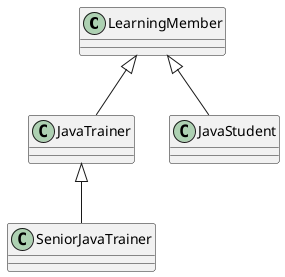

# Core Java Package 7 Notes

- Goal: understand inheritance in Java, `super` keyword usage, inheritance types, overloading and overriding in inheritance, method hiding, field hiding, and interview-focused edge cases.

## What Is Inheritance?

- Inheritance is a mechanism where one class acquires accessible properties and behavior from another class.
- Parent class is also called base class or superclass.
- Child class is also called derived class or subclass.
- Java uses the `extends` keyword for class inheritance.
- Example:

```java
class LearningMember {
    String name;

    String describeRole() {
        return "Base role";
    }
}

class JavaTrainer extends LearningMember {
}
```

- `JavaTrainer` automatically gets accessible members of `LearningMember`.
- Inheritance represents an `is-a` relationship.
- Example: `JavaTrainer is a LearningMember`.

## Why Do We Use Inheritance?

- To reuse common code.
- To avoid duplication.
- To model real-world hierarchy.
- To enable method overriding and runtime polymorphism.
- To keep common behavior in a parent and specialized behavior in the child.

## Simple Inheritance Example In This Package

- `src/core_java_7/LearningMember.java` is the parent class.
- `src/core_java_7/JavaTrainer.java` is a child class.
- `src/core_java_7/SeniorJavaTrainer.java` extends `JavaTrainer`, so it forms a multilevel chain.
- `src/core_java_7/JavaStudent.java` also extends `LearningMember`, so it shows hierarchical inheritance.

## super Keyword In Java

- `super` refers to the immediate parent class object part.
- It is used only in instance context.
- Main uses:
  - access parent field
  - call parent method
  - call parent constructor

### 1. `super` For Parent Field

- If child and parent both have a field with the same name, child field hides parent field.
- To access the parent field, use `super.fieldName`.
- Example from `src/core_java_7/JavaTrainer.java`:

```java
public String showSuperFieldUsage() {
    return "child field=" + this.memberType + ", parent field via super=" + super.memberType;
}
```

### 2. `super` For Parent Method

- If child overrides a method and still wants parent behavior, use `super.methodName()`.
- Example:

```java
@Override
public String describeRole() {
    return super.describeRole() + " Child field says role is " + this.memberType + ".";
}
```

### 3. `super()` For Parent Constructor

- Child constructor can call parent constructor using `super(...)`.
- It must be the first statement in the child constructor.
- Example from `src/core_java_7/JavaTrainer.java`:

```java
public JavaTrainer(String name) {
    super(name, "Mentor");
    this.memberType = "Java Trainer";
}
```

- Constructor chaining order is parent first, child next.

## Types Of Inheritance In Java

### Single Inheritance

- One child extends one parent.
- Example: `JavaTrainer extends LearningMember`.

### Multilevel Inheritance

- A child becomes parent for another child.
- Example: `SeniorJavaTrainer extends JavaTrainer` and `JavaTrainer extends LearningMember`.

### Hierarchical Inheritance

- Multiple child classes extend the same parent.
- Example: `JavaTrainer` and `JavaStudent` both extend `LearningMember`.

### Multiple Inheritance With Classes

- Java does not support multiple inheritance with classes.
- One class cannot extend two classes at the same time.
- Main reason: ambiguity and complexity.
- Java supports multiple inheritance of type through interfaces.

### Hybrid Inheritance

- Hybrid inheritance using classes alone is not supported directly.
- It can be achieved partly using interfaces.

## Inheritance Diagram



## Rules Of Inheritance In Java

- A class can extend only one class.
- Java does not support multiple inheritance using classes.
- Private members are inherited in the object layout sense but are not directly accessible in the child.
- Constructors are not inherited.
- Static members belong to the class, not the object.
- A child class can access parent `public` and `protected` members directly.
- Package-private members are accessible only inside the same package.
- Every class in Java ultimately extends `Object`.

## Overloading In Inheritance

- Overloading means same method name with different parameter list.
- A child class can inherit a parent method and add more overloaded versions.
- Example from `src/core_java_7/JavaTrainer.java`:

```java
@Override
public String guide(Object topic) {
    return "Overridden guide(Object) in child -> " + topic;
}

public String guide(String topic) {
    return "Overloaded guide(String) in child -> " + topic;
}

public String guide(String topic, int minutes) {
    return "Overloaded guide(String, int) in child -> " + topic + " for " + minutes + " minutes";
}
```

- Important interview point:
  - overloading is resolved at compile time
  - compiler checks the reference type to choose the overloaded method set
- So if parent reference points to child object, compiler still sees only methods available in the parent reference type for overloading resolution.

## Overriding In Inheritance

- Overriding means child provides a new implementation for an inherited method with the same signature.
- Overriding gives runtime polymorphism.
- Example:

```java
LearningMember reference = new JavaTrainer("Harshu");
System.out.println(reference.describeRole());
```

- `describeRole()` runs child implementation because runtime object is `JavaTrainer`.

## Rules Of Method Overriding

### 1. Same Method Signature

- Method name and parameter list must be the same.
- Return type must be same or covariant.

### 2. Covariant Return Type

- Child can return a subtype of the parent return type.
- Example in this package:
  - parent `provideMaterial()` returns `CourseMaterial`
  - child `provideMaterial()` returns `PrintedMaterial`

### 3. Parent Final Method Cannot Be Overridden

- Example from `src/core_java_7/LearningMember.java`:

```java
public final String attendancePolicy() {
    return "Final parent method: attendance policy is inherited as-is.";
}
```

- Child can inherit it, but cannot override it.

### 4. Child Overriding Method Can Be Final

- A child may override an inherited method and mark the new version as `final`.
- Then further subclasses cannot override that child version.
- Example from `src/core_java_7/JavaTrainer.java`:

```java
public final String trainingMode() {
    return "Child can override a method and mark that overriding method as final.";
}
```

### 5. Visibility Rules In Overriding

- Child cannot reduce the visibility of an inherited method.
- Child can widen visibility.
- Example:
  - parent `protected String accessWindow()`
  - child `public String accessWindow()`

### 6. Scope Of Modifiers In Overloading

- Overloading does not depend on access modifier.
- You can overload `public`, `protected`, package-private, or `private` methods if parameter list changes.
- But method availability still depends on access control.

### 7. Static Methods Are Hidden, Not Overridden

- Static methods belong to class, not object.
- If child declares static method with same signature, it is method hiding.
- Example:

```java
public static String category() {
    return "Static method hidden in JavaTrainer";
}
```

- Why not overriding?
  - overriding needs runtime dispatch through object
  - static methods are resolved using class/reference information at compile time

### 8. Var-arg Methods can be Overridden should have method signature i.e. both parent and child should have var arsg

- Var-arg is internally treated like an array parameter.
- If signature matches, overriding is valid.
- Example:

```java
@Override
public String revisionPlan(String... topics) {
    return "Child overrides var-arg method";
}
```
- both parent and child should have var-args, if not it is like overloading not overriding

### 9. Variables Are Not Overridden

- Variables do not participate in runtime polymorphism.
- If child declares same variable name, it hides the parent variable.
- Access depends on reference or explicit `super`.

## Is Cyclic Inheritance Possible In Java?

- No.
- A class cannot extend itself directly or indirectly.
- Example not allowed:

```java
class A extends B {}
class B extends A {}
```

- Compiler rejects such code.

## Edge Cases And Interview Scenarios

- Constructors are not inherited, but constructor chaining happens.
- Parent reference can call overridden child method due to runtime polymorphism.
- Parent reference cannot access child-specific overloads because overloading is compile-time based.
- Static methods are hidden, so `ParentReference.staticMethod()` behavior is class/reference based.
- Fields are hidden, not overridden.
- `private` methods are not overridden because they are not inherited for direct access.
- `final` methods are inherited but cannot be overridden.
- `abstract` methods must be implemented by the first concrete child class.

## Inheritance And Tight Coupling

- Inheritance creates strong dependency between child and parent.
- If parent behavior changes, child may break or behave differently.
- Deep inheritance chains become harder to maintain and test.
- Use inheritance when:
  - there is a clear `is-a` relationship
  - parent behavior is stable
  - code reuse also makes design sense
- Prefer composition when:
  - relationship is `has-a`
  - reuse is needed without strong coupling
  - behavior should be swappable independently

## Quick Revision Points

- Inheritance uses `extends`.
- `super` is for immediate parent field, method, and constructor.
- Class inheritance types commonly discussed in Java: single, multilevel, hierarchical.
- Multiple inheritance with classes is not allowed.
- Overloading is compile-time.
- Overriding is runtime.
- Static methods are hidden, not overridden.
- Variables are hidden, not overridden.
- Final parent method cannot be overridden.
- Covariant return type is allowed in overriding.
- Cyclic inheritance is not possible.
