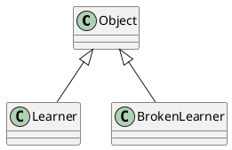
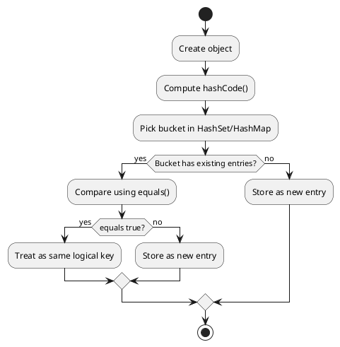

# Core Java Package 9 Notes

- Goal: understand `Object` class fundamentals, implicit inheritance, `equals` and `hashCode` contracts, datatype-specific comparison behavior, and interview-ready edge cases.

## Object Class In Java

- `java.lang.Object` is the root class of the Java class hierarchy.
- Every non-primitive type is directly or indirectly a child of `Object`.
- It provides methods that are common for all objects, such as:
  - identity and equality (`equals`, `hashCode`)
  - string representation (`toString`)
  - runtime class metadata (`getClass`)
  - thread coordination (`wait`, `notify`, `notifyAll`)

## Does Every Object Extend `Object`?

- Yes.
- If you do not explicitly extend any class, compiler adds `extends Object` implicitly.
- Example:

```java
class Student {
}
```

- Compiler treats it as:

```java
class Student extends Object {
}
```

- So each object can call methods like `toString()` and `getClass()`.

## Important Methods In Object Class

- `public final Class<?> getClass()`
  - returns runtime class information.
- `public boolean equals(Object obj)`
  - compares current object with another object.
- `public int hashCode()`
  - returns hash value used by hashing collections.
- `public String toString()`
  - returns string representation (default includes class name + hash).
- `protected Object clone()`
  - creates field-level copy (requires `Cloneable` handling).
- `public final void wait()`, `wait(long)`, `wait(long, int)`
  - current thread waits for notification while holding monitor.
- `public final void notify()` and `notifyAll()`
  - wakes waiting thread(s) on same monitor.
- `protected void finalize()` (deprecated)
  - old GC callback, should not be used for critical cleanup.

## `equals` And `hashCode` - Internal Idea

- Default implementation from `Object`:
  - `equals` behaves like reference comparison (`==`).
  - `hashCode` typically reflects identity-based hash.
- For domain objects, we usually need logical equality (same business data), so we override both.

## `equals` Contract

- Reflexive:
  - `x.equals(x)` must be `true`.
- Symmetric:
  - if `x.equals(y)` is `true`, then `y.equals(x)` must be `true`.
- Transitive:
  - if `x.equals(y)` and `y.equals(z)` are `true`, then `x.equals(z)` must be `true`.
- Consistent:
  - repeated calls should return same result unless compared data changes.
- Null check:
  - `x.equals(null)` must be `false`.

## `hashCode` Contract

- If two objects are equal by `equals`, they must have the same hash code.
- If objects are not equal, hash codes may be same (collision allowed).
- Hash code should be stable while fields involved in equality remain unchanged.

## Why Must We Override Both Together?

- Hash-based collections (e.g., `HashMap`, `HashSet`) first use hash code to locate bucket, then use `equals` for exact match.
- If only `equals` is overridden and `hashCode` is not, equal objects may fall into different buckets.
- Result can be duplicate logical entries and failed lookups.

## Proper Override Example (From This Package)

- `src/core_java_9/Main.java` includes `Learner` class with correct overrides:

```java
@Override
public boolean equals(Object object) {
    if (this == object) {
        return true;
    }
    if (object == null || getClass() != object.getClass()) {
        return false;
    }
    Learner learner = (Learner) object;
    return learnerId == learner.learnerId && Objects.equals(learnerName, learner.learnerName);
}

@Override
public int hashCode() {
    return Objects.hash(learnerId, learnerName);
}
```

- This satisfies both contracts for collections and general comparisons.

## Broken Contract Example

- `src/core_java_9/Main.java` also includes `BrokenLearner`:
  - overrides `equals`
  - does not override `hashCode`
- This is a classic interview trap and causes inconsistent collection behavior.

## Equality Across Different Datatypes

- `String`
  - `==` compares references.
  - `equals` compares content.
- Wrapper classes (`Integer`, `Double`, etc.)
  - `==` may mislead because of caching/autoboxing behavior.
  - prefer `equals` for value comparison.
- Arrays
  - `==` compares references.
  - use `Arrays.equals(arr1, arr2)` for content.
- Floating values
  - edge cases like `-0.0` and `0.0` can surprise in object equality (`Double.equals`).

## Object Class Hierarchy Diagram



## `equals` And `hashCode` Collection Flow



## Interview Specific Scenarios

- Why does `HashSet` keep duplicates even though `equals` says objects are equal?
  - likely `hashCode` not overridden consistently.
- Can two unequal objects have same hash code?
  - yes, collisions are valid.
- Can two equal objects have different hash codes?
  - no, that breaks contract.
- Is `==` always wrong for objects?
  - no, it is correct for reference identity checks, enums, and `null` checks.
- How to compare safely when values may be `null`?
  - use `Objects.equals(a, b)`.
- Is `getClass()` same as `instanceof` in `equals`?
  - no.
  - `getClass()` enforces exact class match.
  - `instanceof` allows subclass matches (can affect symmetry/transitivity if poorly designed).

## Quick Revision Points

- Every class implicitly extends `Object`.
- `Object` methods are available to all objects.
- Override `equals` and `hashCode` together.
- Use `equals` for logical equality and `==` for identity.
- Use `Arrays.equals` for arrays.
- `finalize` is deprecated and should not be used for resource cleanup.
